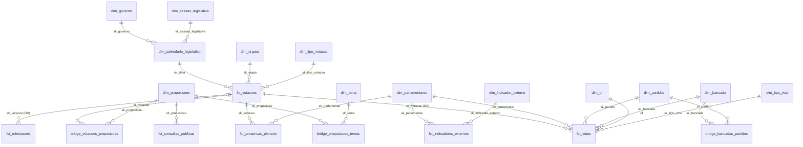

# Mart política

Modelo dimensional das votações, proposições, consultas públicas e indicadores externos da Câmara e do Senado. As definições formais das métricas ficam em `models/presentation/politica/METRICAS.md`, e a autoridade do domínio é o `PRD.md`.

## Entidades

### Fatos

| Modelo                                                     | Representa                                                                      | Grão                                        |
| ---------------------------------------------------------- | ------------------------------------------------------------------------------- | ------------------------------------------- |
| `fct_votacoes`                                             | Votação, com placar, modalidade, sessão e resultado alinhado ao Governo         | votação                                     |
| `fct_votos`                                                | Registro de voto do parlamentar, inclusive abstenção, presidência e ausência    | parlamentar × votação                       |
| `fct_presencas_plenario`                                   | Presença ou ausência (observada ou inferida) nas votações nominais do Plenário  | parlamentar × votação                       |
| `fct_orientacoes`                                          | Orientação de voto de uma liderança                                             | liderança × votação                         |
| `fct_consultas_publicas`                                   | Votos da consulta pública do e-Cidadania em cada extração                       | matéria × data de extração                  |
| `fct_indicadores_externos`                                 | Valor publicado por Radar e Ranking, com período e versão de coleta             | indicador × parlamentar × período × coleta  |
| `fct_governismo_legislatura` / `_trimestre`                | Alinhamento ao Governo calculado pelo modelo                                    | parlamentar × legislatura/trimestre         |
| `fct_radarcongresso_governismo_legislatura` / `_trimestre` | Alinhamento ao Governo publicado pelo Radar (versão vigente)                    | parlamentar × legislatura/trimestre         |
| `fct_ranking_politicos` / `_anual`                         | Pontuação do Ranking dos Políticos (versão vigente)                             | parlamentar / parlamentar × ano             |

### Pontes

| Modelo                            | Representa                                                     | Grão                                   |
| --------------------------------- | -------------------------------------------------------------- | -------------------------------------- |
| `bridge_votacoes_proposicoes`     | Proposições de cada votação, com o tipo da relação             | votação × proposição × tipo            |
| `bridge_proposicoes_temas`        | Temas de cada proposição, próprios ou herdados, sem peso       | proposição × tema                      |
| `bridge_proposicoes_relacionadas` | Proposições principal, anterior e posterior (Câmara)           | proposição × relacionada × tipo        |
| `bridge_bancadas_partidos`        | Composição das federações e blocos, com vigência               | bancada × partido × início             |

### Dimensões

| Modelo                       | Representa                                                          | Grão                               |
| ---------------------------- | ------------------------------------------------------------------- | ---------------------------------- |
| `dim_parlamentares`          | Deputado ou senador                                                 | parlamentar × casa                 |
| `dim_partidos`               | Partido como entidade, agrupando as siglas que já usou              | entidade partidária                |
| `dim_bancada`                | Liderança que orienta: partido, federação, bloco, Governo...        | casa × sigla × partido             |
| `dim_proposicoes`            | Proposição legislativa, com situação e deliberação                  | proposição × casa                  |
| `dim_tema`                   | Tema da proposição (classificação da Câmara)                        | tema                               |
| `dim_calendario_legislativo` | Dia com legislatura, sessão, governo, semana ISO e ano eleitoral    | dia                                |
| `dim_legislatura`            | Legislatura                                                         | legislatura                        |
| `dim_sessao_legislativa`     | Ano legislativo                                                     | legislatura × sessão               |
| `dim_governo`                | Governo do Executivo                                                | presidente × mandato               |
| `dim_casa` / `dim_uf`        | Casa legislativa / UF com região                                    | casa / UF                          |
| `dim_orgaos`                 | Órgão que vota (plenário, comissão, CPI, mesa)                      | casa × sigla                       |
| `dim_tipo_votacao`           | Classe da votação (mérito, procedimental...), nominal e secreta     | classe × nominal × secreta         |
| `dim_tipo_voto`              | Código de voto da origem, com posição e categoria                   | casa × código                      |
| `dim_indicador_externo`      | Indicador publicado por fonte externa, com unidade e metodologia    | fonte × indicador                  |

## Bus matrix

✓ chave no próprio modelo · H herdada do cabeçalho · DD dimensão degenerada · (col) atributo do calendário no agregado

| Fato                        | parlamentar | partido | bancada | calendário | proposição | órgão | tipo votação | tipo voto | UF | indicador |
| --------------------------- | ----------- | ------- | ------- | ---------- | ---------- | ----- | ------------ | --------- | -- | --------- |
| `fct_votacoes`              |             |         |         | ✓          | ✓          | ✓     | ✓            |           |    |           |
| `fct_votos`                 | ✓           | ✓       | ✓       | H          | H          | H     | H            | ✓         | ✓  |           |
| `fct_presencas_plenario`    | ✓           | ✓       |         | ✓          |            |       |              | ✓         | DD |           |
| `fct_orientacoes`           |             | ✓       | ✓       | ✓          |            |       |              |           |    |           |
| `fct_consultas_publicas`    |             |         |         | ✓          | ✓          |       |              |           |    |           |
| `fct_indicadores_externos`  | ✓           |         |         | (período)  |            |       |              |           |    | ✓         |
| `fct_governismo_*`          | ✓           |         |         | (período)  |            |       |              |           |    |           |
| `fct_radarcongresso_*`      | ✓           |         |         | (período)  |            |       |              |           |    |           |
| `fct_ranking_politicos*`    | ✓           |         |         | (ano)      |            |       |              |           |    |           |

## Diagrama

## Observações

- `fct_votacoes` é o cabeçalho e `fct_votos` as linhas (header/line); o voto herda as chaves do cabeçalho.
- `fct_votos` guarda os registros observados; as ausências inferidas da Câmara ficam só em `fct_presencas_plenario`, marcadas.
- Voto e orientação se encontram pela entidade de `dim_partidos`, não pela sigla; a bancada do voto é a federação ou bloco do partido na data.
- Indicadores externos preservam o valor da fonte e cada versão coletada; métricas do modelo e da fonte têm nomes distintos (`_modelo`, `_radar`).

## Regras derivadas

Regras que o PRD não define e o domínio aplica. Cada uma está no modelo indicado.

| Regra | Onde |
| --- | --- |
| Classe da votação (mérito, emenda, urgência...) por expressões regulares sobre a descrição | `int_votacoes_unificadas` |
| Tipo do órgão inferido pela sigla (PLEN, MESA, CPI, comissão especial, comissão) | `dim_orgaos` |
| Votação do Senado sem colegiado informado é do Plenário | `int_votacoes_unificadas` |
| Voto FAVORÁVEL COM RESTRIÇÕES (comissões da Câmara) e SIM do Presidente (art. 48 RISF) contam como SIM; P-OD (obstrução declarada, Senado) como OBSTRUÇÃO; BRANCO fica fora das posições | `seed_tipos_voto` |
| Placar da votação secreta do Senado: totais oficiais de SIM, NÃO e abstenção | `fct_votacoes` |
| Modalidade: secreta pela origem; nominal aberta quando há voto SIM, NÃO ou OBSTRUÇÃO; o resto sem registro nominal (a Câmara não distingue a simbólica) | `fct_votacoes` |
| Empate e prejudicado no Senado são resultado não binário | `stg_senado_votacoes` |
| Orientação do Senado resolvida pela matéria no dia, com desempate pelo placar | `int_orientacoes_senado_filtradas` |
| Partido resolvido para a entidade por sigla e data; rebrands juntos, siglas reutilizadas separadas | `int_partidos_siglas`, `dim_partidos` |
| UF do senador fora de exercício: a do mandato mais recente | `int_senadores_padronizados` |
| Tipo de liderança imputado na Câmara pela sigla nas outras orientações | `int_orientacoes_camara_corrigidas` |
| Tipo de bancada pelo prefixo da sigla; na Câmara, siglas coladas sem prefixo são bloco | `dim_bancada` |
| Bancada do voto: federação antes de bloco, pela vigência da seed | `fct_votos` |
| Câmara: deputado em exercício entre o primeiro e o último voto nominal do Plenário na legislatura; sem registro nesse intervalo, ausência inferida com partido e UF do voto anterior | `fct_presencas_plenario` |
| Participação e presença só no Plenário; governismo e disciplina incluem comissões | `parlamentar_periodo` (macro) |
| Partido e UF do período: os de mais votos, desempate alfabético; sem voto com posição, vale a presença | `parlamentar_periodo` (macro) |
| Semana ISO (segunda a domingo) | `dim_calendario_legislativo` |
| Sessão legislativa de 1º/fev a 31/jan | `dim_calendario_legislativo`, `dim_sessao_legislativa` |
| No dia da posse vale o presidente que assume | `dim_calendario_legislativo` |
| Trimestre do Radar = data publicada menos um dia | `int_indicadores_radar_versoes`, `fct_radarcongresso_governismo_trimestre` |
| Escala dos componentes do Ranking detectada pelo teto do ano (`fl_componentes_normalizados`) | `score_vs_governismo` |
| Índice de Rice sem obstrução, com ao menos dois votos SIM/NÃO do grupo | `comportamento_entidade` (macro) |
| Consulta pública: vale a última extração; empate não tem resultado | `consultas_publicas` |
| Deliberação do Senado → APROVADA, REJEITADA ou OUTRO, pré-preenchida por palavra-chave, ao lado do efeito (FAVOR, CONTRA, NEUTRO) | `seed_senado_tipos_decisao` |
| Proposição: o status diário do Senado vale antes do processo; a Câmara vence pela data mais recente e tipo válido | `int_proposicoes_unificadas` |
| API e arquivo anual trazem as mesmas proposições: vence o status mais recente; no empate, a API (Câmara) ou a última carga (Senado). Vínculos entre proposições vêm da fonte que os preenche | `stg_camara_proposicao`, `stg_senado_processo` |
| Proposição sem tema próprio herda os temas da principal, um nível só | `bridge_proposicoes_temas` |

## Lacunas de fonte

O que o PRD pede e o dado extraído não permite. Tudo está fora deste repositório, no `my_ingestion`.

| Extração | Destrava |
| --- | --- |
| Câmara `/votacoes/{id}` (objetos possíveis e proposições afetadas) | Vínculo votação × proposição para as nominais sem objeto (86%); tipos AFETADA e POSSIVEL_OBJETO na ponte |
| Câmara `/proposicoes/{id}/autores`; Senado autoria e relatoria com código de parlamentar | Grão proposição × parlamentar × papel |
| Câmara `/proposicoes/{id}/tramitacoes`; Senado movimentações | Tramitação, tempo até a conclusão e etapas |
| Deliberação do Senado para as matérias do e-Cidadania em tramitação | Cobertura da aderência à consulta pública (hoje 25 matérias; 2.419 sem deliberação) |
| Câmara `/deputados/{id}/historico` | Exercício real no lugar do período observado; inclui os deputados em exercício sem voto nominal no Plenário (5 a 30 por legislatura), hoje fora de `fct_presencas_plenario` |
| Câmara `/orgaos` | Nome e tipo oficial do órgão |
| Chave de pessoa entre as casas (CPF) | Mudança de Casa |
| e-Cidadania: ideias legislativas, apoios e eventos | Demais formas de participação popular |
