# Mart política

Modelo dimensional das votações da Câmara e do Senado.

## Entidades

### Fatos

| Modelo                                                     | Representa                                                      | Grão                                |
| ---------------------------------------------------------- | --------------------------------------------------------------- | ----------------------------------- |
| `fct_votacoes`                                             | Votação, com placar e resultado                                 | votação                             |
| `fct_votos`                                                | Registro de voto do parlamentar, inclusive abstenção e ausência | parlamentar × votação               |
| `fct_orientacoes`                                          | Orientação de voto de uma liderança                             | liderança × votação                 |
| `fct_governismo_legislatura` / `_trimestre`                | Alinhamento ao Governo, calculado a partir dos votos            | parlamentar × legislatura/trimestre |
| `fct_radarcongresso_governismo_legislatura` / `_trimestre` | Alinhamento ao Governo publicado pelo Radar Congresso           | parlamentar × legislatura/trimestre |
| `fct_ranking_politicos`                                    | Pontuação atual no Ranking dos Políticos                        | parlamentar                         |
| `fct_ranking_politicos_anual`                              | Pontuação anual no Ranking dos Políticos                        | parlamentar × ano                   |

### Dimensões

| Modelo                       | Representa                                                          | Grão                       |
| ---------------------------- | ------------------------------------------------------------------- | -------------------------- |
| `dim_parlamentares`          | Deputado ou senador                                                 | parlamentar × casa         |
| `dim_partidos`               | Partido como entidade, agrupando as siglas que já usou              | entidade partidária        |
| `dim_proposicoes`            | Proposição legislativa (PL, PEC, MP...)                             | proposição × casa          |
| `dim_calendario_legislativo` | Dia com legislatura, sessão legislativa, presidente e ano eleitoral | dia                        |
| `dim_orgaos`                 | Órgão que vota (plenário, comissão, CPI, mesa)                      | casa × sigla               |
| `dim_tipo_votacao`           | Tipo de votação (mérito, procedimental...), nominal e secreta       | classe × nominal × secreta |
| `dim_tipo_voto`              | Código de voto da origem, com posição e categoria                   | casa × código              |

## Bus matrix

✓ chave no próprio modelo · DD dimensão degenerada · (col) atributo do calendário materializado no agregado

| Modelo                                      | dim_parlamentares | dim_partidos | dim_calendario_legislativo    | dim_proposicoes | dim_orgaos  | dim_tipo_votacao | dim_tipo_voto | fct_votacoes | Grão                      |
| ------------------------------------------- | ----------------- | ------------ | ----------------------------- | --------------- | ----------- | ---------------- | ------------- | ------------ | ------------------------- |
| `fct_votacoes`                              |                   |              | ✓                             | ✓               | ✓           | ✓                |               | —            | votação                   |
| `fct_votos`                                 | ✓                 | ✓            | ✓                             | ✓ (herdada)     | ✓ (herdada) | ✓ (herdada)      | ✓             | DD           | parlamentar × votação     |
| `fct_orientacoes`                           |                   | ✓            | ✓                             |                 |             |                  |               | DD           | votação × liderança       |
| `fct_governismo_legislatura`                | ✓                 |              | (legislatura)                 |                 |             |                  |               |              | parlamentar × legislatura |
| `fct_governismo_trimestre`                  | ✓                 |              | (legislatura, ano, trimestre) |                 |             |                  |               |              | parlamentar × trimestre   |
| `fct_radarcongresso_governismo_legislatura` | ✓                 |              | (legislatura)                 |                 |             |                  |               |              | parlamentar × legislatura |
| `fct_radarcongresso_governismo_trimestre`   | ✓                 |              | (legislatura, ano, trimestre) |                 |             |                  |               |              | parlamentar × trimestre   |
| `fct_ranking_politicos`                     | ✓                 |              |                               |                 |             |                  |               |              | parlamentar               |
| `fct_ranking_politicos_anual`               | ✓                 |              | (ano)                         |                 |             |                  |               |              | parlamentar × ano         |

## Diagrama

```mermaid
erDiagram
    dim_parlamentares          ||--o{ fct_votos                                 : sk_parlamentar
    dim_calendario_legislativo ||--o{ fct_votos                                 : sk_data
    dim_proposicoes            ||--o{ fct_votos                                 : sk_proposicao
    dim_tipo_voto              ||--o{ fct_votos                                 : sk_tipo_voto
    dim_partidos               ||--o{ fct_votos                                 : sk_partido
    dim_orgaos                 ||--o{ fct_votos                                 : sk_orgao
    dim_tipo_votacao           ||--o{ fct_votos                                 : sk_tipo_votacao
    fct_votacoes               ||--o{ fct_votos                                 : "sk_votacao (DD)"

    dim_calendario_legislativo ||--o{ fct_votacoes                              : sk_data
    dim_proposicoes            ||--o{ fct_votacoes                              : sk_proposicao
    dim_orgaos                 ||--o{ fct_votacoes                              : sk_orgao
    dim_tipo_votacao           ||--o{ fct_votacoes                              : sk_tipo_votacao
    dim_partidos               ||--o{ fct_orientacoes                           : sk_partido
    fct_votacoes               |o--o{ fct_orientacoes                           : "sk_votacao (DD)"
    dim_calendario_legislativo ||--o{ fct_orientacoes                           : sk_data

    dim_parlamentares          ||--o{ fct_governismo_legislatura                : sk_parlamentar
    dim_parlamentares          ||--o{ fct_governismo_trimestre                  : sk_parlamentar
    dim_parlamentares          ||--o{ fct_radarcongresso_governismo_legislatura : sk_parlamentar
    dim_parlamentares          ||--o{ fct_radarcongresso_governismo_trimestre   : sk_parlamentar
    dim_parlamentares          ||--o| fct_ranking_politicos                     : sk_parlamentar
    dim_parlamentares          ||--o{ fct_ranking_politicos_anual               : sk_parlamentar

    fct_votacoes {
        text sk_votacao PK
        int  sk_data FK
        text sk_proposicao FK
        text sk_orgao FK
        text sk_tipo_votacao FK
        text orientacao_governo "DD"
        int  fl_aprovada
        int  fl_nominal
        int  fl_resultado_alinhado_governo
        int  qt_votantes
    }
    fct_votos {
        text sk_voto PK
        text sk_votacao "DD"
        text sk_parlamentar FK
        text sk_partido FK
        int  sk_data FK
        text sk_proposicao FK
        text sk_tipo_voto FK
        text partido "DD"
        text voto
        int  fl_seguiu_governo
        int  fl_seguiu_partido
    }
    fct_orientacoes {
        text sk_votacao "DD"
        int  sk_data FK
        text sigla_lideranca
        text orientacao_voto
    }
    fct_governismo_legislatura {
        text sk_parlamentar FK
        int  legislatura
        int  qt_votos_alinhados_governo
        int  qt_votos_governismo
    }
    fct_radarcongresso_governismo_legislatura {
        text sk_parlamentar FK
        int  legislatura
        int  governismo_pct_radar
    }
    dim_calendario_legislativo {
        int  data_sk PK "mesma chave de dim_datas"
        int  legislatura
        text presidente
    }
    dim_tipo_voto {
        text sk_tipo_voto PK
        text posicao
        text categoria
    }
    dim_partidos {
        text sk_partido PK
        int  partido_id_nk
        text sigla
    }
    dim_tipo_votacao {
        text sk_tipo_votacao PK "junk: classe × nominal × secreta"
        text classe_votacao
        text grupo_votacao
    }
```

## Observações

- `fct_votacoes` é o cabeçalho e `fct_votos` as linhas (header/line). O voto herda as chaves do cabeçalho;
  `sk_votacao` fica nas duas como dimensão degenerada.
- `fct_votos` guarda todos os registros da origem; as métricas filtram pelas flags `fl_seguiu_*` ou por `voto`.
- `fct_governismo_*` são somas de `fct_votos.fl_seguiu_governo`, no mesmo grão das fatos do Radar.
- No Senado a orientação tem outra chave; a votação é resolvida pela matéria no dia e a não resolvida vai
  para `null_key`.
- Voto e orientação se encontram pela entidade de `dim_partidos`, não pela sigla.
