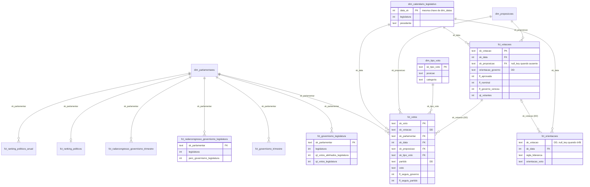

# Relacionamentos — marts/politica

## Bus matrix

✓ chave no próprio modelo · DD dimensão degenerada · (col) atributo do calendário materializado no agregado

| Modelo                                      | dim_parlamentares | dim_calendario_legislativo      | dim_proposicoes | dim_tipo_voto | fct_votacoes | Grão                        |
| ------------------------------------------- | ----------------- | ------------------------------- | --------------- | ------------- | ------------ | --------------------------- |
| `fct_votacoes`                              |                   | ✓                               | ✓               |               | —            | votação                     |
| `fct_votos`                                 | ✓                 | ✓                               | ✓ (herdada)     | ✓             | DD           | parlamentar × votação       |
| `fct_orientacoes`                           |                   | ✓                               |                 |               | DD           | votação × liderança         |
| `fct_governismo_legislatura`                | ✓                 | (legislatura)                   |                 |               |              | parlamentar × legislatura   |
| `fct_governismo_trimestre`                  | ✓                 | (legislatura, ano, trimestre)   |                 |               |              | parlamentar × trimestre     |
| `fct_radarcongresso_governismo_legislatura` | ✓                 | (legislatura)                   |                 |               |              | parlamentar × legislatura   |
| `fct_radarcongresso_governismo_trimestre`   | ✓                 | (legislatura, ano, trimestre)   |                 |               |              | parlamentar × trimestre     |
| `fct_ranking_politicos`                     | ✓                 |                                 |                 |               |              | parlamentar                 |
| `fct_ranking_politicos_anual`               | ✓                 | (ano)                           |                 |               |              | parlamentar × ano           |

## Diagrama

## Observações

- `fct_votacoes` é o cabeçalho e `fct_votos` são as linhas (padrão header/line de Kimball). O voto herda
  do cabeçalho `sk_data` e `sk_proposicao`, então nenhum corte de voto precisa passar por
  `fct_votacoes`; `sk_votacao` fica nas duas como dimensão degenerada, para drill-across.
- `fct_votos` guarda todos os registros da origem (abstenção, presidência, voto secreto, presença sem
  voto e ausências). As métricas filtram: governismo e disciplina pelas flags `fl_seguiu_*`, placar e
  bancada por `voto IN ('SIM', 'NAO', 'OBSTRUCAO')`.
- `fct_governismo_*` são somas de `fct_votos.fl_seguiu_governo` e têm o mesmo grão das fatos do Radar,
  para comparar as duas fontes lado a lado.
- A maior parte das orientações do Senado é órfã (`sk_votacao = null_key`): o `codigovotacaosve` do
  endpoint de orientação é outro espaço de chave. O teste de `relationships` avisa quantas.
- `dim_calendario_legislativo` é o recorte público de `dim_datas` (mesma `data_sk`), sem as datas especiais
  da família, com legislatura, presidente e anos eleitorais.
